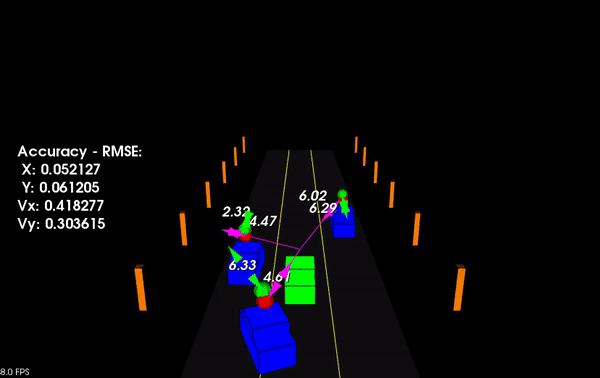
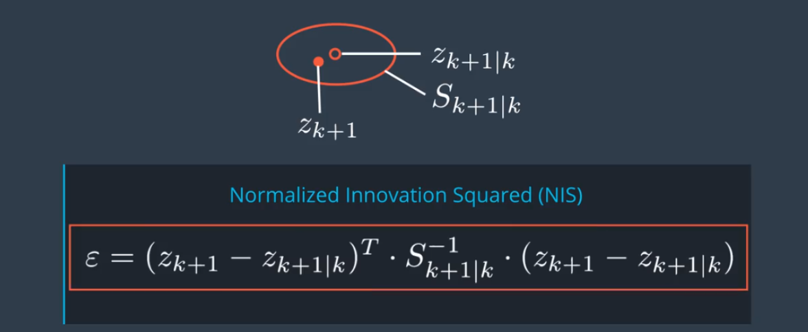
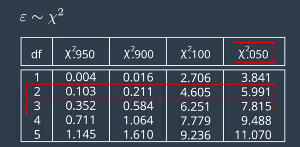
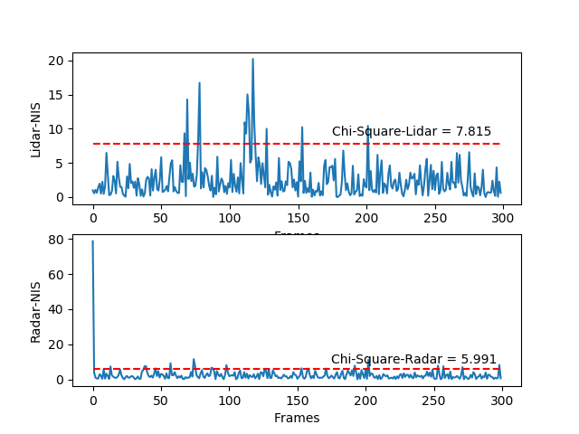

# SFND Unscented Kalman Filter
In this project I implemented an Unscented Kalman Filter to estimate the state of multiple cars on a highway using noisy lidar and radar measurements.  My `px, py, vx, and vy RMSE` is less than the values [0.30, 0.16, 0.95, 0.70] after the simulator has ran for longer than 1 second.

<div align=center> </div>

`main.cpp` is using `highway.h` to create a straight 3 lane highway environment with 3 traffic cars and the main ego car at the center. The viewer scene is centered around the ego car and the coordinate system is relative to the ego car as well. The ego car is green while the other traffic cars are blue. The traffic cars will be accelerating and altering their steering to change lanes. Each of the traffic car's has it's own UKF object generated for it, and will update each one during every time step. 

The red spheres above cars represent the (x,y) lidar detection and the purple lines show the radar measurements with the velocity magnitude along the detected angle. The green spheres is tracking the traffic cars indicating estimated position and green magnitude arrows showing estimated velocity value and direction.  The Z axis is not taken into account for tracking, so I are only tracking along the X/Y axis.

## NIS Results Evaluation

### NIS (Normalized Innovation Square)

A filter is consistent if it provides a realistic estimation uncertainty. So I check my filter with an important consistency check called NIS(Normalized Innovation Square). The innovation is the difference between the predicted measurement and the actual measurement. And normalized means you put it into relation to the covariance matrix S. The NIS is just a scalar number.

<div align=center> </div>


The NIS value follow a distribution which is called chi-square distribution. And this bellow table tells you the number you should expect for your NIS. DF means degrees of freedom. That is the dimensions of our measurement space. We have a three-dimensional radar measurement, so we have three degrees freedom, but two degrees for radar. 0.05 says statistically for Lidar, in 0.05% of all cases, your NIS will be greater than 7.815,  and similar to Radar.

<div align=center> </div>

<div align=center> </div>

What you can always do when you design a filter is plot the 95% line. In my case, that's 7.815 for Lidar and 5.991 for Radar. And then for every time step k, calculate and plot also the NIS value of **traffic[0]**.  From the above NIS graph,  my filter is consistent for both Lidar and radar with 95% NIS values for all frames are less than chi-square(0.05).

## My Code for NIS

I am very familiar with python, so I choose to plot NIS with [**matplotlibcpp**](https://github.com/lava/matplotlib-cpp) . You can find the detailed tutorial  from the [**link**](https://readthedocs.org/projects/matplotlib-cpp/downloads/pdf/latest/). Firstly,  I put `matplotlibcpp.h` in my project directory, and secondly,  I add my code in `main.cpp` as follow:

```C++
#include "matplotlibcpp.h"
namespace plt = matplotlibcpp;
int main(){
	// plot NIS for Traffic[0]
	std::vector<double> lidarNIS = highway.traffic[0].ukf.lidarNIS;
	std::vector<double> radarNIS = highway.traffic[0].ukf.radarNIS;

	float chiSquareLidar = 7.815;
	float chiSquareRadar = 5.991;
	std::vector<float> chiLidar(lidarNIS.size(), chiSquareLidar);
	std::vector<float> chiRadar(radarNIS.size(), chiSquareRadar);

	std::vector<int> x_lidar;
	for(int i = 0; i < lidarNIS.size(); ++i)
	{
		x_lidar.push_back(i);
	}
	std::vector<int> x_radar;
	for(int i = 0; i < radarNIS.size(); ++i)
	{
		x_radar.push_back(i);
	}
	plt::subplot(2,1,1);
	plt::plot(x_lidar, lidarNIS);
	plt::plot(x_lidar, chiLidar, "r--");
	plt::text(175, 9, "Chi-Square-Lidar = 7.815");
	plt::xlabel("Frames");
	plt::ylabel("Lidar-NIS");

	plt::subplot(2,1,2);
	plt::plot(x_radar, radarNIS);
	plt::plot(x_radar, chiRadar, "r--");
	plt::text(175, 9, "Chi-Square-Radar = 5.991");
	plt::xlabel("Frames");
	plt::ylabel("Radar-NIS");

	//plt::save("./NIS.pdf");
	plt::show();
}
```

Lastly, I must adding the python package to the [CMakeLists.txt](./CMakeLists.txt) like this:

```c++
find_package(PythonLibs 2.7)
target_include_directories(ukf_highway PRIVATE ${PYTHON_INCLUDE_DIRS})
target_link_libraries (ukf_highway ${PCL_LIBRARIES} ${PYTHON_LIBRARIES})
```

## Other Important Dependencies

* cmake >= 3.5
  * All OSes: [click here for installation instructions](https://cmake.org/install/)
* make >= 4.1 (Linux, Mac), 3.81 (Windows)
  * Linux: make is installed by default on most Linux distros
  * Mac: [install Xcode command line tools to get make](https://developer.apple.com/xcode/features/)
  * Windows: [Click here for installation instructions](http://gnuwin32.sourceforge.net/packages/make.htm)
* gcc/g++ >= 5.4
  * Linux: gcc / g++ is installed by default on most Linux distros
  * Mac: same deal as make - [install Xcode command line tools](https://developer.apple.com/xcode/features/)
  * Windows: recommend using [MinGW](http://www.mingw.org/)
 * PCL 1.2

## Basic Build Instructions

1. Clone this repo.
2. Make a build directory: `mkdir build && cd build`
3. Compile: `cmake .. && make`
4. Run it: `./ukf_highway`

## Editor Settings

We've purposefully kept editor configuration files out of this repo in order to
keep it as simple and environment agnostic as possible. However, we recommend
using the following settings:

* indent using spaces
* set tab width to 2 spaces (keeps the matrices in source code aligned)

## Code Style

Please stick to [Google's C++ style guide](https://google.github.io/styleguide/cppguide.html) as much as possible.

## Generating Additional Data

This is optional!

If you'd like to generate your own radar and lidar modify the code in `highway.h` to alter the cars. Also check out `tools.cpp` to
change how measurements are taken, for instance lidar markers could be the (x,y) center of bounding boxes by scanning the PCD environment
and performing clustering. This is similar to what was done in Sensor Fusion Lidar Obstacle Detection.

## Project Instructions and Rubric

This information is only accessible by people who are already enrolled in Sensor Fusion. 
If you are enrolled, see the project page in the classroom
for instructions and the project rubric.
